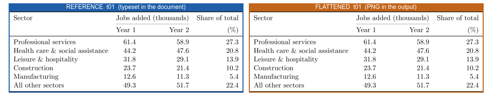
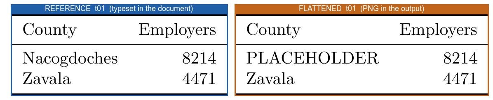
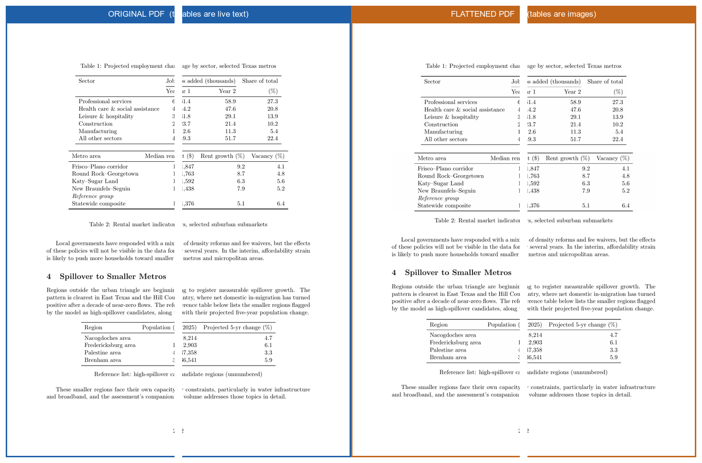
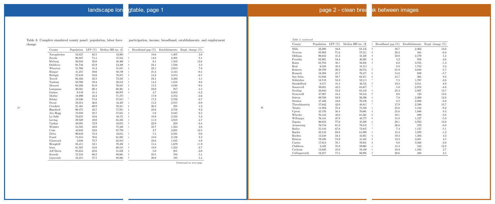

# tablepngs

Flatten every table in a LaTeX document into a high-resolution PNG, so that
PDF-to-Word conversion leaves your tables intact — then prove it worked.

One command in, three things out:

```
python3 tablepngs.py main.tex
# -> main_tablepngs.tex   a copy of your document with tables swapped for images
# -> main_tablepngs.pdf   compiled, verified, ready to hand to Acrobat
# -> main_tablepngs/      the PNGs, one (or more, for multi-page tables) per table
```

Works with **pdflatex, xelatex, and lualatex**, and with the table
environments you actually use: `tabular`, `tabularx`, `booktabs`,
`threeparttable`, `siunitx`, `multirow`, `colortbl`, Stata `esttab`/`estout`
fragments pulled in with `\input`, multi-page `longtable`/`xltabular`,
`sidewaystable`, and `pdflscape` landscape pages.

## Why

Anyone who has watched a carefully formatted booktabs table turn into abstract
art during a PDF-to-Word conversion knows the problem. Acrobat's converter
detects text that looks tabular and rebuilds it as a native Word table, and
that reconstruction is what breaks: columns merge, rules vanish, spanners
land in the wrong cells. A flat image is immune. Acrobat treats it as a
picture, drops it onto the Word page, and moves on.

Rasterizing by hand does not scale past one table: isolate the table, rebuild
enough preamble for it to compile, crop it, convert it, re-include it, and
repeat after every revision. `tablepngs` automates the whole loop and then
proves the result worked.

```
              WITHOUT tablepngs                    WITH tablepngs
        ┌──────────────────────────┐        ┌──────────────────────────┐
        │  PDF: text-based table   │        │  PDF: table is a PNG     │
        └────────────┬─────────────┘        └────────────┬─────────────┘
                     ▼                                   ▼
          Acrobat "Export to Word"            Acrobat "Export to Word"
                     │                                   │
        "helpfully" reconstructs a            sees a picture, places a
        Word table from the text —            picture — layout preserved
        columns shift, rules vanish
```

## How it works

The key design choice: table snippets are re-typeset **with your document's
own preamble** (same class, packages, macros, fonts, `\textwidth`), not a
generic standalone shell. Custom commands in cells, siunitx setup, colors,
and fontspec fonts all render exactly as they do in your document. Captions
and `\label`s are lifted out before rendering and re-emitted as live text
around the image, so table numbering, `\ref`, hyperlinks, and the List of
Tables keep working in the flattened document, and captions stay searchable
in Word.

```
 main.tex
    │
    │  1. SCAN        comment-aware parse: table floats, longtables,
    │                 bare tabulars; captions/labels lifted out
    ▼
 ┌─────────────┐  2. RE-TYPESET   each table body alone, with YOUR preamble
 │ t01 t02 t03 │      ├─ normal tables: `preview` package, tight-cropped page
 │  ...        │      └─ longtables:    your page geometry, one page per chunk,
 └─────────────┘                        cropped with pdfcrop
    │
    │  3. RASTERIZE   pdftoppm | magick | gs   (300 dpi default)
    ▼
 main_tablepngs/t01-p01.png ...
    │
    │  4. REWRITE     splice \includegraphics into a copy of the document;
    │                 captions + labels stay live text; longtable chunks
    │                 become page-fitting images that break cleanly
    ▼
 main_tablepngs.tex ── compile ──► main_tablepngs.pdf
    │
    │  5. VERIFY      extract the PDF text layer and prove the table text
    │                 is GONE (nothing for Acrobat to reconstruct) while
    │                 every caption is still present as text
    │
    │  6. COMPARE     (--compare) re-render each table in its real document
    ▼                 context and check the flattened PNG against it
  PASS / FAIL
```

Step 5 is the point of the whole exercise: Acrobat can only mangle a table it
can read. If distinctive strings from every table body are absent from the
final PDF's text layer, there is nothing left to reconstruct.

## Proving the images are not mangled

A flattened table is an image, so a typo-free text layer is no guarantee that
the picture is right. `--compare` closes that gap: it re-renders every table
a second time **inside the real document**, then checks the flattened PNG
against that rendering.

```
python3 tablepngs.py main.tex --compare
```

Two automatic screens, plus a sheet for your own eyes:

- **content check** (every table): each literal word and number written in
  the table source must appear in the rasterized image's text layer. Catches
  dropped rows and cells, and it is page-break invariant, so it works on
  multi-page longtables.
- **pixel check** (tables cropped via `preview`): the flattened PNG must
  match the in-context rendering exactly — a clean run reports
  `pixels 0.0000`. Longtables are cropped by a different path, so their
  pixel score is reported as not applicable and the content check governs.
- **side-by-side sheets** in `<stem>_tablepngs/_compare/`, blue = as typeset
  in your document, orange = the flattened PNG.

Sample output:

```
    t01  content 31/31 ok   pixels 0.0000            [ok]  _compare/t01-compare.png
    t02  content 257/257 ok pixels n/a (see sheet)   [ok]  _compare/t02-compare.png
[tablepngs] VISUAL PASS — every flattened table matches its in-document rendering
```

A passing sheet — the flattened PNG is pixel-identical to the table as
typeset in the document:



This is not a formality. A table can compile cleanly in isolation and still
render the *wrong content* — the classic case is a macro defined in the
preamble and redefined mid-document, where a snippet built from the preamble
alone silently keeps the stale value. The repo ships exactly that case as a
negative control at `tests/fixtures/mangle_control/`, and the check catches
it: `content 5/5 ok, pixels 0.2427 [MISMATCH]`, exit code 3, and the sheet
shows the problem at a glance:



The test suite asserts that this fixture keeps failing; if it ever passes,
the verification has stopped working.

Multi-page and rotated tables get the treatment you would do by hand.
Longtables are compiled with your exact page geometry, split into one image
per page, and re-inserted as a stack of images sized to fit the text block
(capped at 85% of `\textheight`), so a page break falls cleanly between
images instead of a float drifting away from its anchor. `sidewaystable` and
`landscape` wrappers stay in the document; only their contents are flattened,
so rotation still happens in LaTeX and landscape longtables produce wide
page-per-chunk images.

## Install

You need Python 3.8+, a TeX distribution, and one PDF-to-PNG tool. Run the
built-in doctor to see what is missing and how to fix it:

```
python3 tablepngs.py --check
```

**macOS** (Homebrew):

```bash
brew install --cask mactex-no-gui   # TeX (skip if you have MacTeX/TeX Live)
brew install poppler                # pdftoppm + pdftotext (recommended)
# optional fallbacks: brew install imagemagick ghostscript
```

**Linux** (Debian/Ubuntu):

```bash
sudo apt install texlive-latex-extra texlive-extra-utils   # TeX + pdfcrop
sudo apt install poppler-utils                             # pdftoppm + pdftotext
# optional fallbacks: sudo apt install imagemagick ghostscript
```

Note for ImageMagick on Linux: many distros ship a `policy.xml` that blocks
PDF input. Prefer poppler; it has no such restriction.

**Windows** (PowerShell, with [Chocolatey](https://chocolatey.org)):

```powershell
# TeX: install MiKTeX (https://miktex.org) or TeX Live, ensure it is on PATH
choco install poppler ghostscript
```

`pdfcrop` ships with TeX Live and MiKTeX. It is only needed for multi-page
longtables; the doctor will tell you if it is missing
(`tlmgr install pdfcrop`).

## Run it

**macOS / Linux** (Terminal):

```bash
cd /path/to/your/document
python3 /path/to/tablepngs.py main.tex
```

**Windows** (PowerShell or cmd):

```powershell
cd C:\path\to\your\document
py C:\path\to\tablepngs.py main.tex
```

Then open `main_tablepngs.pdf` in Acrobat and export to Word as usual.
Your original `main.tex` is never modified.

Useful flags:

| flag | what it does |
|---|---|
| `--check` | dependency doctor with per-OS install instructions |
| `--list` | dry run: show the tables it found, touch nothing |
| `--compare` | visual verification: re-render each table in context and check the PNG against it (needs ImageMagick) |
| `--compare-threshold X` | pixel-difference tolerance for `--compare` (default 0.06) |
| `--engine xelatex` | force an engine (default: auto-detected, see below) |
| `--dpi 600` | higher-resolution PNGs (default 300) |
| `--page-height 0.99` | pack multi-page-table chunks tighter (default 0.96) |
| `--only 2,5` / `--skip 3` | flatten only some tables (indices from `--list`) |
| `--no-bare` | ignore tabulars that are not inside a float or longtable |
| `--shell-escape` | pass through to the engine if your document needs it |
| `--keep-build` | keep intermediate files for debugging |
| `--no-verify` | skip the text-layer verification pass |

Exit codes: `0` success and verified, `1` error, `2` built but text-layer
verification found leaked table text, `3` built but the visual comparison
found a table that does not match its in-document rendering.

## Demonstration gallery

`examples/` contains eight self-contained documents that double as the test
suite. Each has a `manifest.json` declaring its engines and expected table
count; `tests/run_tests.py` runs the full matrix (12 example x engine cases,
plus the negative control) and checks that every table flattens, verifies,
and matches its in-document rendering.

| example | exercises | engines |
|---|---|---|
| `01_basic_booktabs` | captions above/below, `\caption*`, multicolumn | pdflatex |
| `02_stata_esttab` | esttab-style `\input` fragments, threeparttable, `\resizebox` | pdflatex |
| `03_longtable` | 3-page longtable with all head/foot blocks, 1-page longtable | pdflatex |
| `04_rotated` | sidewaystable, landscape float, multi-page landscape longtable | pdflatex |
| `05_unicode_fontspec` | fontspec, accented + non-Latin text, symbols | xelatex, lualatex |
| `06_fancy_styling` | colortbl stripes, siunitx S columns, multirow, tabularx, custom macros | pdflatex, lualatex |
| `07_refs_cites` | `\citep` and `\ref` inside table cells (natbib + bibtex) | pdflatex |
| `08_kitchen_sink` | all of the above plus a bare in-prose tabular, one document | all three |
| `09_real_world_patterns` | patterns taken from a real report that broke earlier versions: a house `.sty`, `\counterwithin{table}{section}`, styling applied via `\begingroup` from outside the environment, a longtable caption with `\footnote` and a nested `\label`, comments inside table bodies, a macro inside a caption | pdflatex |

The flattened document is visually indistinguishable from the original — the
tables just happen to be images now:



Multi-page landscape longtables are split into one image per page and
anchored so a page break falls cleanly between images:



Run the suite:

```bash
python3 tests/run_tests.py               # full matrix, visual check included
python3 tests/run_tests.py 03 08         # just examples 03 and 08
python3 tests/run_tests.py --keep        # keep outputs to inspect
python3 tests/run_tests.py --no-compare  # faster: skip the visual pass
```

```
mangle_control × pdflatex                PASS (mangle correctly caught)
01_basic_booktabs × pdflatex             PASS (6s, 3 png)
...
08_kitchen_sink × lualatex               PASS (21s, 7 png)
13/13 passed
```

## Using it from Claude

This repo doubles as a Claude Code plugin: the `tablepngs` skill in
`.claude/skills/tablepngs/` teaches Claude to drive the script — check
dependencies, pick the right engine, run the conversion, read the
verification report, and troubleshoot failures — rather than hand-rolling
its own conversion. Working inside this repo, Claude picks it up
automatically; to use it everywhere, copy the folder:

```bash
mkdir -p ~/.claude/skills
cp -r .claude/skills/tablepngs ~/.claude/skills/
cp tablepngs.py ~/.claude/skills/tablepngs/   # bundle the script with the skill
```

Then, in any project: "flatten the tables in report.tex so the PDF converts
to Word cleanly."

## Details worth knowing

- **Engine detection.** In order: a `% !TEX program` magic comment, then the
  engine recorded in a `.log`/`.xdv` from your last build, then a scan of the
  preamble *and* any local `.sty`/`.cls` files it loads (so `fontspec` buried
  inside a house style file is still found). If the baseline compile then
  fails with an engine-mismatch error, the other engines are tried
  automatically before giving up.
- **Formatting applied from outside the table.** A table is often wrapped in
  styling it does not contain:
  ```latex
  \begingroup\footnotesize\setlength{\tabcolsep}{3pt}\hfuzz=20pt
  \begin{longtable}{...}
  ```
  That context is captured and reused — including primitive register
  assignments like `\hfuzz=20pt` — because rendering the table at the wrong
  size changes its column widths, and an image wider than `\linewidth` then
  gets scaled down, making the table smaller than it is in your document.
  Style state that *leaks document-wide* is replayed too: a top-level
  `\setlength{\tabcolsep}{4pt}` in one appendix silently restyles every
  table after it, and the snippets reproduce that.
- **Split style trees.** A house style in `../shared/` that
  `\RequirePackage`s a sibling package resolves via an automatic `TEXINPUTS`
  extension covering every local style directory the document pulls in, the
  same way project build scripts usually arrange it.
- **Multi-page tables** are re-emitted as a one-column `longtable` of page
  images. Rows break across pages natively, so the chunks stay in place
  instead of floating, and the caption is reproduced verbatim in the same kind
  of environment it came from — which keeps constructs like a `\footnote` or a
  nested `\label` inside the caption working.
- **Page count can grow.** A rasterized table cannot split across a page the
  way a live longtable can, so a big table that used to start mid-page now
  moves to the next one. The run reports the before/after page count and warns
  if the document grew more than 10%.
- **Unsupported table environments are named, not silently skipped.** If the
  document uses something tablepngs cannot flatten, it says so with the line
  number and what to do about it.

- **Cites and refs inside cells.** The snippet compile imports your main
  document's `.aux`, so `\ref` and bibtex/natbib `\cite` inside table cells
  render with the correct numbers in the image. (biblatex citations inside
  cells are the one known gap; they render as `[?]` in the image.)
- **Numbering stays consistent.** Captions are re-emitted as text, so the
  table counter advances normally in the flattened document; `\thetable`
  used inside a table body (continued headers) is pre-seeded to the right
  value in the snippet.
- **Sizing.** Images are included at their natural typeset size, capped at
  `\linewidth` (or `\textheight` of run length for sideways tables) and 85%
  of `\textheight`, so nothing overflows a page.
- **What is left alone.** Figures, equations, verbatim blocks, commented-out
  tables, and everything else that is not a table.
- **Original untouched.** All output goes to new files; run it again any
  time the tables change.

## Limitations

- A table inside a **custom box environment** (a tcolorbox-style call-out,
  `minipage`, `adjustbox`, ...) is typeset against that box's inner width,
  which an isolated snippet cannot reproduce. The table still flattens with
  complete content, but its proportions can differ from the original — the
  run names the wrapper environment, the `--compare` sheet shows the
  difference, and `--skip <n>` leaves that table as live text if the
  original look matters more.
- Tables inside `beamer` frames are out of scope (slide decks are rarely
  converted to Word).
- A float containing several `\caption`s is flattened with the captions baked
  into the image (a warning tells you; the table counter is still advanced).
- `\footnote` inside a flattened table body cannot emit a real footnote from
  inside an image; the mark is baked in.
- biblatex citations inside table cells render as `[?]` in the image (bibtex
  and natbib work via the `.aux` import).

## License

MIT. Issues and PRs welcome.
